# 2025: 15 Top-Tier Cloud-Based LinkedIn Prospecting Tools You Must Know (Latest Compilation)

Picture this: You're manually clicking through hundreds of LinkedIn profiles, copying emails into spreadsheets, drafting connection requests one by one, and by Thursday afternoon you've burned through five hours just to reach 30 people. Meanwhile, your competitor closed three deals because they automated the boring stuff and spent those five hours actually talking to interested leads. That gap? It's what separates teams hitting quota from teams wondering why LinkedIn "doesn't work."

Modern LinkedIn prospecting software handles the grunt work—auto-connecting, message sequencing, email enrichment, CRM syncing—so sales teams can focus on conversations that convert. Whether you're running solo outreach or managing ten accounts for clients, the tools below solve the core pain points: time waste, manual errors, low reply rates, and impossible-to-scale workflows.

***

## **[Waalaxy](https://www.waalaxy.com)**

Cloud-based LinkedIn and email automation built for prospecting teams who need multichannel outreach without technical hassles.

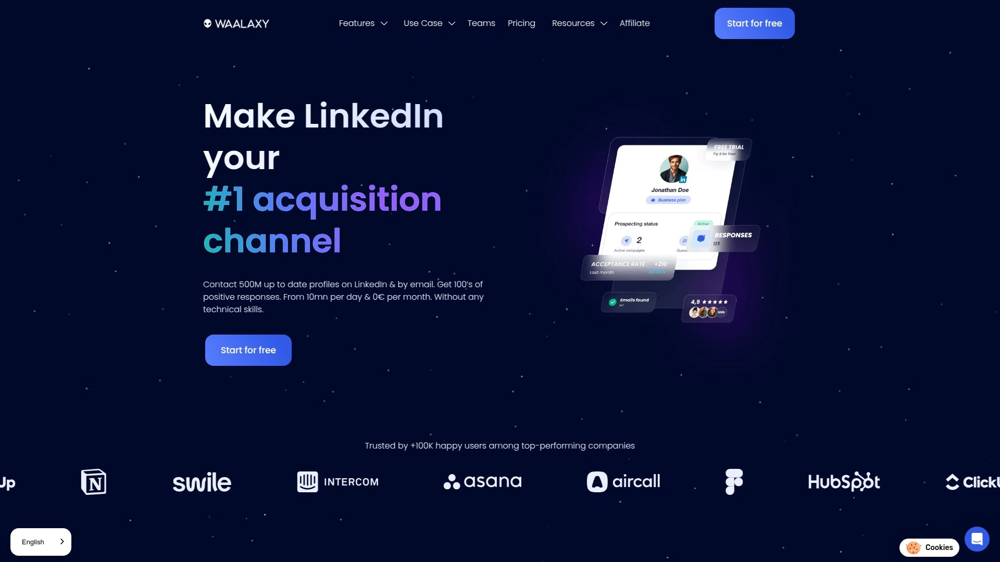

Waalaxy makes LinkedIn prospecting stupidly simple. Install the Chrome extension, import prospects from LinkedIn Search or Sales Navigator with one click, pick a campaign template from 50+ pre-built sequences (LinkedIn + email combos), and let it run. The platform sends connection requests, follow-up messages, and emails automatically while you sleep. Built-in email finder (powered by Dropcontact) grabs verified addresses, so you can pivot to email when LinkedIn limits kick in. The shared inbox consolidates all conversations from multiple accounts, CRM sync pushes leads to HubSpot or Pipedrive instantly, and team analytics show who's crushing it and who needs coaching.

Waalaxy stands out because it's genuinely no-code. Non-technical users launch campaigns in under ten minutes. The AI assistant (Waami) writes message copy based on millions of successful campaigns in their database, so you're not staring at blank templates wondering what converts. Cloud-based execution means campaigns run 24/7 without keeping your laptop on, and safety features mimic human behavior to keep accounts secure.

Pricing starts free (100 invites/week, basic automation), Pro at €30/month (1,000 invites/week, LinkedIn automation, CRM integration), Advanced at €60/month (1,500 invites/week, multichannel LinkedIn + email), and Business at €120/month (2,500 invites/week, priority support, team collaboration). The freemium plan is genuinely useful for testing workflows before committing.

***

## **[Apollo.io](https://www.apollo.io)**

All-in-one sales intelligence platform combining a 275M+ contact database with engagement automation and performance analytics.

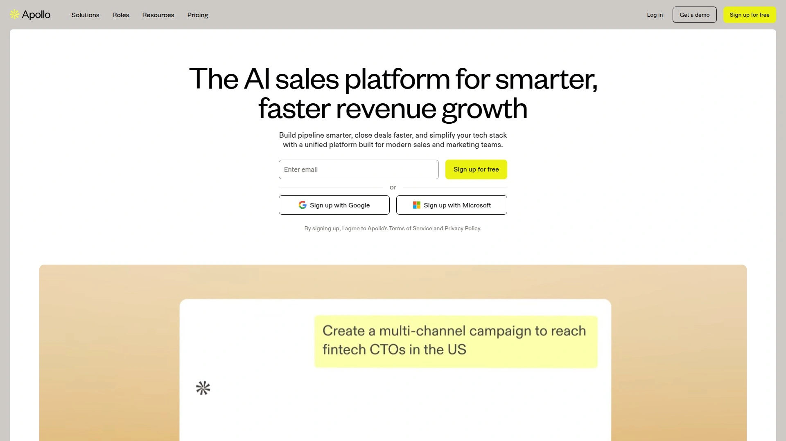

Apollo isn't just a prospecting tool—it's a full sales operating system. Search 275 million contacts and 73 million companies using 65+ filters (job changes, tech stack, intent signals, company size), export verified emails and direct dials instantly (solving Sales Navigator's export nightmare), build automated email sequences, make calls with built-in dialer, and track everything in real-time dashboards. The Chrome extension pulls contact data while browsing LinkedIn or company websites. Apollo integrates natively with Salesforce, HubSpot, and 2,000+ apps via Zapier, syncing leads bidirectionally so nothing falls through cracks.

What separates Apollo: intent data shows which prospects are actively researching solutions like yours, giving you perfect timing for outreach. Lead scoring powered by AI prioritizes accounts most likely to convert. The platform combines prospecting, engagement, and analytics in one interface, eliminating tool-switching chaos. For teams tired of juggling six different subscriptions, Apollo consolidates the stack.

Free plan includes 60 mobile credits and 120 export credits monthly. Paid plans start at $49/month (Basic), $99/month (Professional with unlimited email sequences and advanced filters), and custom pricing for organizations needing API access and dedicated support.

***

## **[Dripify](https://dripify.io)**

Advanced LinkedIn automation running entirely in the cloud with drip campaigns, team management, and detailed analytics for scaling outreach safely.

Dripify eliminates the browser extension headaches. Everything runs cloud-based, meaning campaigns execute 24/7 from Dripify's servers using dedicated IPs (LinkedIn sees consistent login locations, reducing red flags). Build complex drip sequences with if/then logic—send message A if they accept your connection, message B if they ignore it, pivot to email if LinkedIn limits are hit. Smart inbox consolidates conversations across multiple LinkedIn accounts, auto-pauses campaigns when leads reply, and exports lead data (name, company, email, phone) to CSV. Team management features let managers assign roles, track individual performance, and oversee campaigns without micromanaging every message.

Dripify's safety obsession includes random delays between actions, human behavior simulation (varied typing speeds, realistic pause patterns), and daily action limits you control. The platform works with free LinkedIn, Premium, Sales Navigator, and Recruiter Lite accounts. Analytics break down acceptance rates, response rates, and funnel performance, showing exactly where campaigns win or lose.

Pricing: Basic at $39/month (1 LinkedIn account, unlimited campaigns), Pro at $59/month (advanced analytics, A/B testing), and Advanced at $79/month (team management, priority support). Seven-day free trial available.

---

## **[Kaspr](https://www.kaspr.io)**

Chrome extension extracting verified emails and direct dials from LinkedIn profiles in real-time—perfect for on-the-fly prospecting.

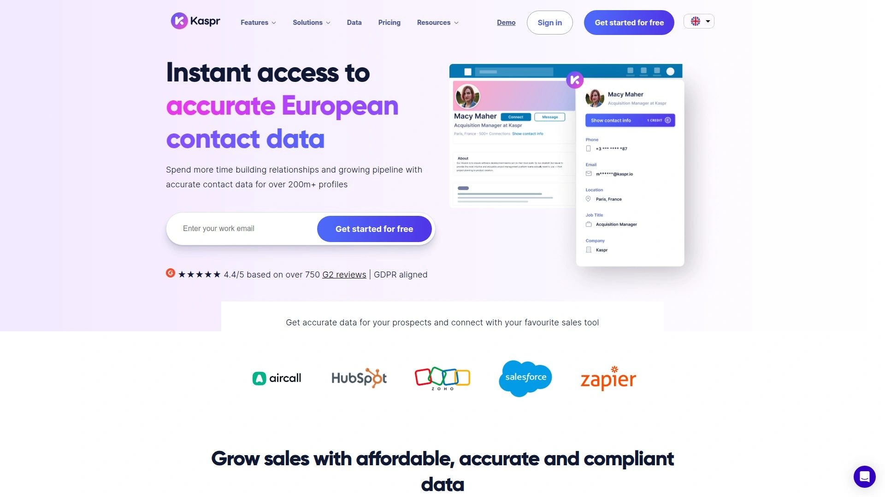

Kaspr is the fastest way to grab contact data without leaving LinkedIn. Browse any LinkedIn profile, click the Kaspr widget that pops up, and instantly reveal email address and phone number (when available). The tool enriches data in real-time by checking 120+ sources, ensuring accuracy. Export contacts to CSV, send directly to your CRM (Salesforce, HubSpot, Pipedrive), or save to Kaspr's dashboard for later. Bulk enrichment lets you process entire LinkedIn search result pages at once. Team collaboration features allow shared lists and performance tracking.

What makes Kaspr special: it's GDPR-compliant by design, sourcing data legally and ethically. The free plan genuinely works (50 credits monthly), making it risk-free to test data quality. Kaspr integrates seamlessly into prospecting workflows—find lead on LinkedIn, grab contact info, push to CRM, move on—no tab-switching or manual entry.

Free plan includes 50 credits/month. Paid plans start €45/user/month (500 credits, email + phone access, CRM integrations, team features). Enterprise plans available for high-volume teams.

***

## **[LinkedIn Sales Navigator](https://business.linkedin.com/sales-solutions/sales-navigator)**

LinkedIn's official premium prospecting platform with 50+ advanced search filters, unlimited searches, InMail messaging, and real-time buyer intent signals.

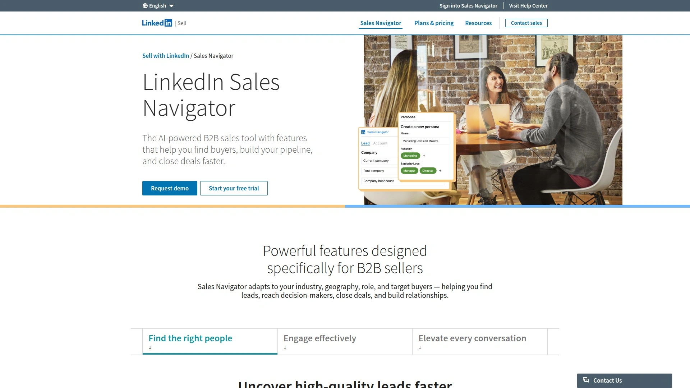

Sales Navigator is LinkedIn's native solution for serious prospecting. Advanced search filters drill down by function, seniority, years at company, industry, geography, company headcount, and 40+ other criteria, surfacing leads free LinkedIn never shows. Save custom searches and receive real-time alerts when saved leads change jobs, post content, or get mentioned in news (perfect timing for outreach). InMail credits let you message anyone on LinkedIn without connection limits. TeamLink shows which colleagues are connected to your target prospects, providing warm intro paths. Account IQ uses AI to generate summaries of target companies, streamlining research.

Sales Navigator integrates directly with CRMs (Salesforce, HubSpot, Microsoft Dynamics) via Advanced Plus plan, auto-syncing leads and preventing duplicate data entry. Buyer intent features flag accounts showing interest in your category, prioritizing hottest opportunities. The Relationship Explorer visualizes decision-maker hierarchies within target accounts.

Pricing: Core at ~$100/month (individual users), Advanced at ~$140/month (CRM integration, TeamLink, buyer intent), Advanced Plus (custom pricing for teams needing admin controls and reporting). LinkedIn frequently updates pricing; check their site for current rates.

***

## **[Expandi](https://expandi.io)**

Fully cloud-based LinkedIn outreach tool with smart sequences, multichannel campaigns, and hyper-personalization features for agencies and growth teams.

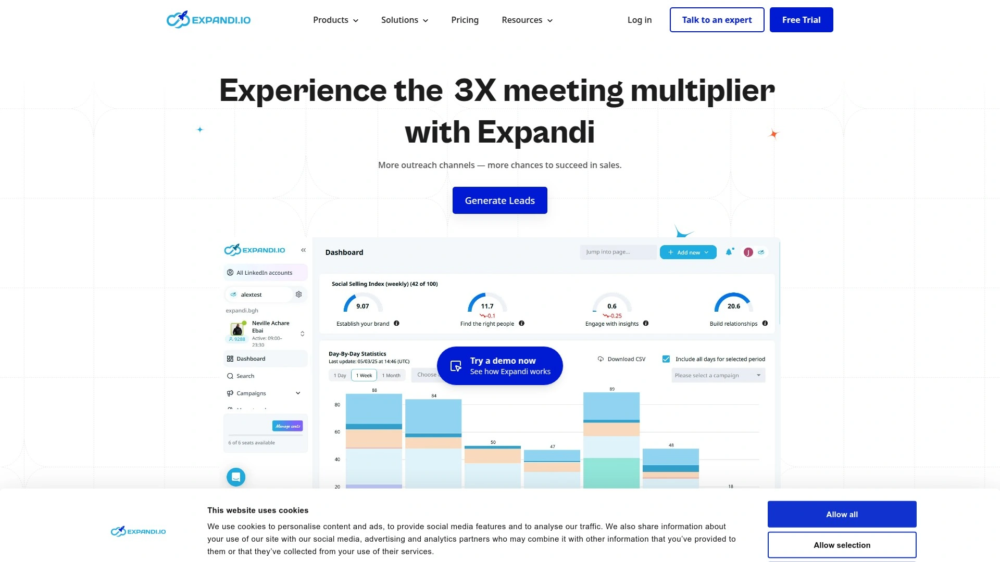

Expandi runs campaigns from dedicated cloud servers using country-specific IPs, making automation nearly invisible to LinkedIn. Smart sequences adapt based on prospect actions—if they view your profile, send follow-up A; if they accept connection, send message B; if no response after 5 days, trigger email sequence. GIF personalization embeds prospect's name or company into custom images, dramatically boosting reply rates. Auto warm-up gradually increases activity on new accounts to build credibility. The global smart inbox manages conversations across multiple LinkedIn accounts and emails from one dashboard.

Expandi shines for agencies managing client accounts. Workspace feature separates campaigns, data, and inboxes per client, with master dashboard overseeing everything. Campaign priority management ensures high-value sequences get attention first. Detailed metrics track acceptance rates, response rates, and funnel performance per campaign and sender. Blacklist features prevent accidentally messaging existing clients or competitors.

Pricing: Business plan at $99/month (unlimited campaigns, LinkedIn + email, advanced targeting, smart sequences). Agency plan offers custom pricing for managing multiple client accounts. Seven-day free trial available.

---

## **[PhantomBuster](https://phantombuster.com)**

Automation and scraping platform offering 50+ LinkedIn Phantoms (automated workflows) for extracting data, engaging content, and multichannel prospecting.

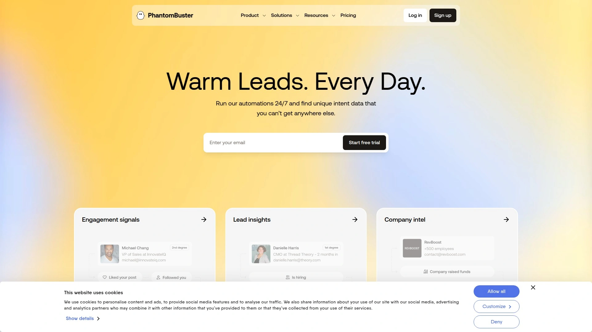

PhantomBuster isn't a traditional automation tool—it's a workflow automation platform with pre-built "Phantoms" that execute specific LinkedIn tasks. LinkedIn Profile Scraper extracts complete profile data (name, job, company, education, email when public) from URLs or search results. LinkedIn Search Export pulls all profiles from LinkedIn searches into CSV. Company Employees Export grabs employee lists from company pages. Combine Phantoms into automated sequences: scrape profiles → enrich emails (via integrated tools like Dropcontact) → auto-connect → send messages. PhantomBuster integrates with 20+ data enrichment and outreach tools, creating custom workflows impossible with standard automation tools.

The platform also automates engagement actions—auto-like posts, auto-comment on content, auto-endorse skills—building visibility before outreach. Everything runs cloud-based with webhook triggers for advanced integrations. PhantomBuster appeals to technical users comfortable building custom automation flows. The flexibility is unmatched, but the learning curve is steeper than plug-and-play tools.

Pricing: Free plan (limited executions). Paid plans start €56/month (20 hours execution time, 5 concurrent Phantoms), scaling to €592/month for high-volume automation. Fourteen-day free trial available.

---

## **[Lemlist](https://www.lemlist.com)**

Sales engagement platform specializing in multichannel cold outreach across email, LinkedIn, WhatsApp, and calls with AI-powered personalization and deliverability optimization.

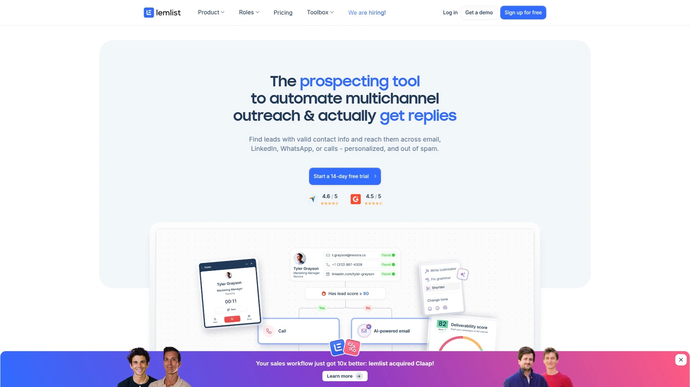

Lemlist started as a cold email tool and evolved into a full multichannel prospecting platform. The built-in email finder enriches leads from 450M+ contact database, verifies addresses, and sequences outreach across email, LinkedIn, and cold calls. AI campaign generator writes copy, suggests sending times, and personalizes messages using liquid syntax (dynamic content based on prospect data). Custom image personalization embeds prospect's company logo or name into visuals, driving higher engagement. Email warm-up feature gradually sends emails from new addresses to build sender reputation, keeping messages out of spam.

Lemlist's strength is deliverability engineering. Inbox rotation distributes sends across multiple email accounts, preventing volume-based spam triggers. A/B testing optimizes subject lines, CTAs, and send times. Real-time reporting shows open rates, click rates, reply rates, and conversions per campaign. CRM integrations (HubSpot, Salesforce, Pipedrive) sync contacts bidirectionally. The LinkedIn Chrome extension imports prospects directly into campaigns without leaving LinkedIn.

Pricing: Email Starter at $32/user/month (email campaigns, 750 finder credits), Email Pro at $55/user/month (warm-up, CRM integration, custom personalization), Multichannel Expert at $79/user/month (LinkedIn + email + calls, 1,500 finder credits, premium support), Outreach Scale at $129/user/month (2,500 finder credits, dedicated account manager). Fourteen-day free trial available.

---

## **[Hunter.io](https://hunter.io)**

Domain-based email finder and verification tool helping prospectors locate and validate professional email addresses at scale.

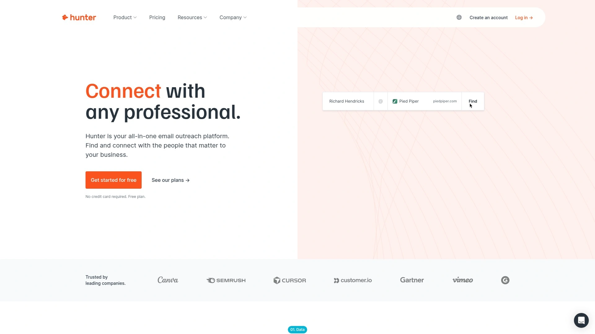

Hunter excels at one thing: finding and verifying emails. Search by domain (e.g., "hunter.io") to see all email addresses Hunter found associated with that company, pattern recognition suggests likely addresses for employees not yet in database. Email Finder uses first name, last name, and company domain to predict professional email addresses with confidence scores. Bulk Email Verifier processes entire lists, checking syntax, domain validity, MX records, and SMTP responses to confirm deliverability. The Chrome extension works on LinkedIn and company websites, revealing emails while prospecting.

Hunter's verification prevents bounces that damage sender reputation. Status labels (valid, invalid, accept-all, unknown) help prioritize outreach. API access allows integration into custom workflows and apps. Hunter focuses exclusively on email discovery—no outreach automation, no CRM—making it a perfect complement to tools handling engagement. Pair Hunter with Lemlist or Apollo for complete prospecting-to-outreach workflows.

Free plan includes 25 searches and 50 verifications monthly. Paid plans start $49/month (500 searches, 1,000 verifications), scaling to $399/month for high-volume users. API-only plans available for developers.

***

## **[Lusha](https://www.lusha.com)**

B2B data enrichment platform providing accurate contact info, company intelligence, and buyer intent signals directly in browser and CRM.

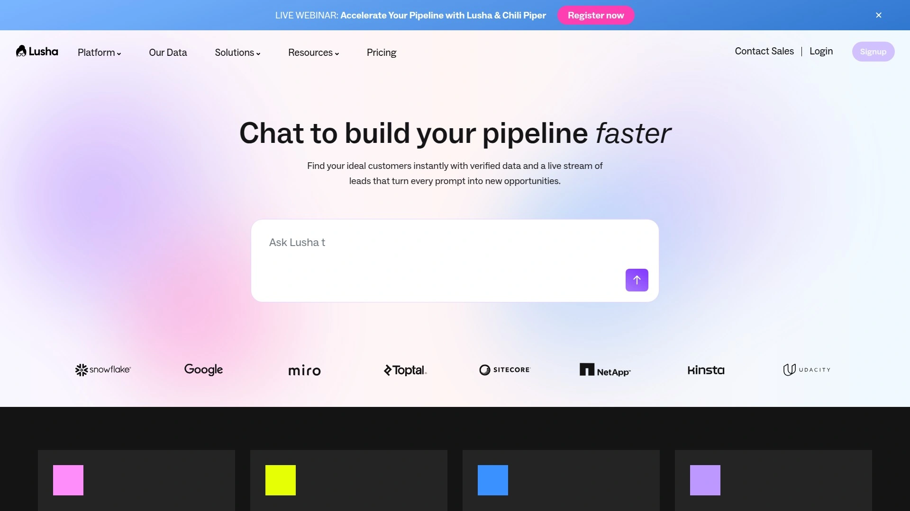

Lusha's Chrome extension reveals direct dials, mobile numbers, and verified emails while browsing LinkedIn, Sales Navigator, or company websites. The tool enriches beyond basic contact data—job changes, buyer intent signals, funding rounds, revenue estimates, company specialties, employee counts—giving context for personalized outreach. Bulk enrichment processes lists of hundreds or thousands of contacts at once. CRM enrichment (Salesforce integration) automatically updates existing leads and contacts with fresh data, keeping databases accurate without manual cleanup. API enrichment connects Lusha to any system for real-time data access.

Lusha's data accuracy is its differentiator. The platform checks 120+ sources and validates against Lusha's proprietary database before surfacing results. Free tier genuinely works (5 credits monthly), letting you test data quality before paying. The tool integrates with HubSpot, Salesforce, Pipedrive, and 50+ CRMs via native connections and Zapier. Lusha Engage adds email sequencing capabilities, creating a full prospecting-to-outreach solution.

Free plan includes 5 credits monthly. Paid plans start $39/user/month (Pro: 80 credits, CRM sync, data enrichment), scaling to custom enterprise pricing for teams needing API access and dedicated support.

***

## **[MeetAlfred](https://meetalfred.com)**

Multichannel outreach automation combining LinkedIn, email, and Twitter in unified sequences with built-in CRM and social posting scheduler.

MeetAlfred automates outreach across three channels from one dashboard. Build sequences that start on LinkedIn (connection request + message), follow up via email if no reply, and optionally engage on Twitter—all triggered automatically based on prospect actions. The Smart Inbox consolidates conversations from all channels, preventing messages from getting lost across platforms. Built-in CRM tracks lead status, tags, notes, and activities without needing external systems. Social media scheduler posts content to LinkedIn and Twitter, building visibility while outreach runs in background.

MeetAlfred uses AI to suggest message improvements, optimal send times, and audience targeting based on successful campaign data. Tag Manager organizes contacts by interest, funnel stage, or custom criteria. Auto-withdraw feature removes pending connection requests after X days to stay under LinkedIn limits. The platform works with LinkedIn Free, Premium, and Sales Navigator accounts. Pricing is transparent and affordable compared to enterprise alternatives.

Free trial available. Paid plans start $29/month (1 LinkedIn account, email outreach, basic CRM), scaling to team plans supporting multiple users and advanced analytics. LinkedIn + email + Twitter outreach runs from all plans.

***

## **[Octopus CRM](https://octopuscrm.io)**

Trusted LinkedIn automation extension with funnel-building capabilities, activity monitoring, and integrations with Zapier and HubSpot for workflow automation.

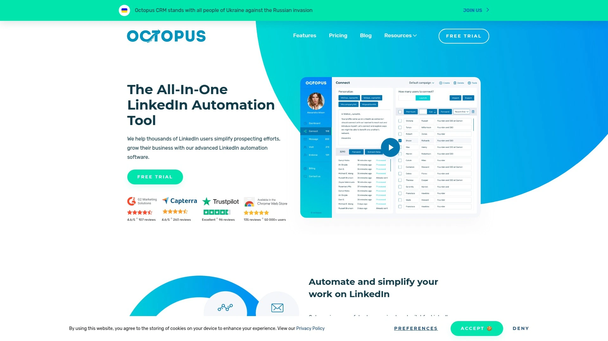

Octopus CRM sits in your browser as a Chrome extension, automating LinkedIn actions while you work. Send personalized connection requests, bulk message 1st-degree connections, auto-endorse skills (warm prospects before pitching), auto-view profiles (trigger reciprocal views), and link campaigns together to create full funnels (connect → thank-you message → offer → follow-up). The Personal CRM dashboard organizes prospects, tracks activity, and shows campaign performance. Activity Control monitors your LinkedIn usage and alerts you if approaching unsafe limits, protecting accounts from restrictions.

Octopus works with all LinkedIn account types—Free, Premium, Sales Navigator, Recruiter Lite. Connect by Email feature bypasses LinkedIn's weekly invite cap by sending connection requests via email instead of LinkedIn interface. Zapier and HubSpot integrations push leads to external systems automatically. Export/import features move data between platforms via CSV. Octopus is affordable and beginner-friendly, making it accessible for solopreneurs and small teams just starting LinkedIn automation.

Pricing: Starter at $6.99/month (basic automation, personal CRM), Pro at $14.99/month (funnel building, integrations, stats), Advanced at $21.99/month (Zapier/HubSpot, activity control, priority support), Unlimited at $39.99/month (unlimited campaigns, account manager). Seven-day free trial available.

---

## **[HeyReach](https://www.heyreach.io)**

Agency-focused LinkedIn automation built for multi-account management with sender rotation, unified inbox, and white-label capabilities.

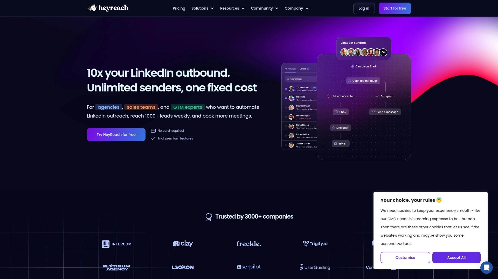

HeyReach solves the biggest LinkedIn scaling problem: daily connection limits (20-40/day). Instead of maxing out one account, HeyReach rotates through multiple LinkedIn senders on a single campaign, distributing outreach across 5, 10, or 50 accounts while respecting per-account limits. This lets agencies send 1,000+ invites daily without flagging any individual account. The Unified Inbox consolidates conversations from all senders into one dashboard—no more logging in/out of dozens of accounts. Client workspace feature isolates campaigns, data, and inboxes per client, with master dashboard giving agencies bird's-eye view of all activity.

HeyReach includes anti-duplication protection (preventing multiple senders from contacting same prospect), API access for custom integrations, 20+ webhook events for triggering external workflows, and white-label options for agencies branding the tool as their own. The platform works with free LinkedIn and Sales Navigator accounts. Team collaboration features assign inboxes to specific members, tag hot leads, and escalate opportunities.

Pricing: Starter at $79/month (3 LinkedIn accounts), Agency at $799/month (50 accounts), Unlimited at $1,999/month (unlimited accounts, white-label, API access). Built specifically for agencies and sales teams managing multiple senders.

***

## **[LinkedIn Sales Navigator + Evaboot](https://evaboot.com)**

Specialized export tool solving Sales Navigator's data extraction limitations—clean, formatted LinkedIn lead lists in seconds.

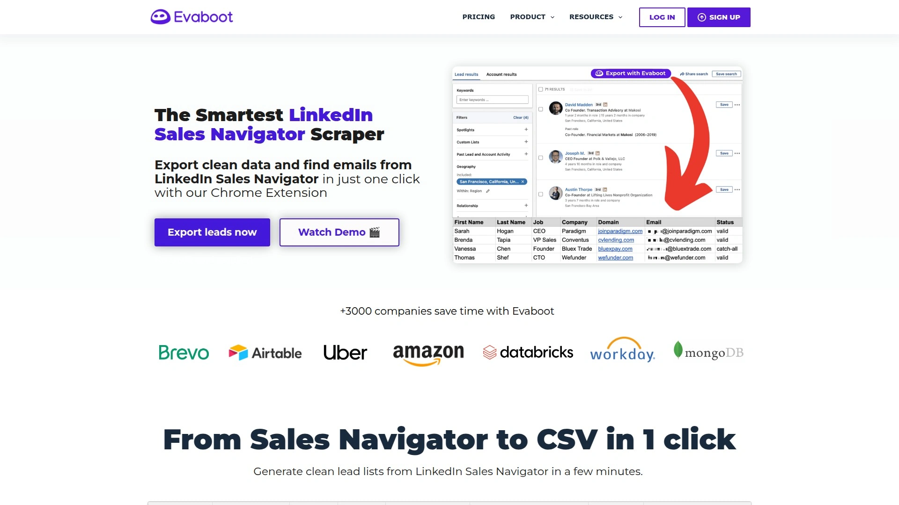

Sales Navigator doesn't let you easily export search results. Evaboot fixes that. The Chrome extension sits alongside Sales Navigator, allowing you to export entire search result pages (up to 2,500 leads) into clean CSV files with one click. Unlike native exports, Evaboot cleans data automatically—removing "LinkedIn Member" placeholders, formatting names properly, extracting company domains, and organizing columns for immediate use in outreach tools. Export includes profile URLs, job titles, locations, company names, employee counts, and industry classifications.

Evaboot is a must-have for teams using Sales Navigator who need to move leads into CRMs, email tools, or LinkedIn automation platforms. The tool also flags premium LinkedIn members (who get InMails), helping prioritize outreach strategies. Evaboot doesn't automate outreach—it just makes data extraction painless and accurate, eliminating hours of manual copy-paste and data cleanup.

Pricing: Starter at €29/month (500 exports), Pro at €79/month (2,500 exports), Business at €189/month (10,000 exports). Works exclusively with LinkedIn Sales Navigator (not free LinkedIn).

***

## **[Skylead](https://www.skylead.io)**

Smart LinkedIn and email automation with email discovery, image personalization, and unlimited email follow-ups for leads not connecting.

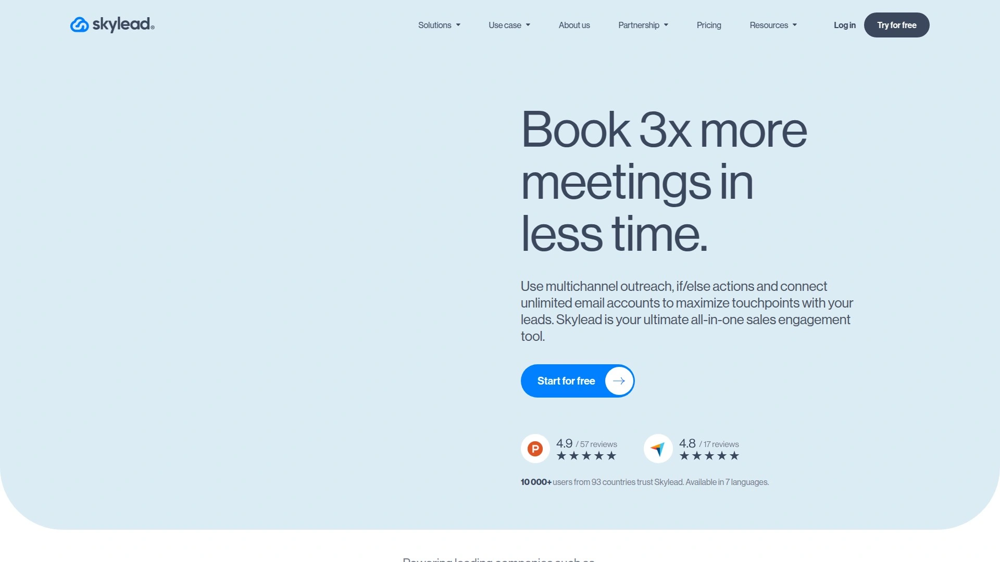

Skylead combines LinkedIn automation with aggressive email outreach. Smart sequences automatically switch from LinkedIn to email if connection requests aren't accepted, ensuring you never lose touch with prospects. Built-in email finder enriches leads from LinkedIn, grabbing verified addresses without external tools. Image and GIF personalization embeds prospect-specific details into visuals for attention-grabbing messages. The platform tracks profile visits, messages sent, emails delivered, and responses across both channels, providing unified analytics.

Skylead's "unlimited email accounts" feature rotates sends across multiple inboxes, improving deliverability and avoiding volume caps. CRM integrations sync with HubSpot, Salesforce, Pipedrive, and Zapier-connected apps. The tool emphasizes safety with daily limits, random delays, and human behavior simulation. Skylead works well for teams frustrated by low LinkedIn acceptance rates—the email fallback ensures prospects get reached regardless.

Pricing: Starter at $100/month (1 LinkedIn account, unlimited email accounts, smart sequences), Scale at $170/month (3 LinkedIn accounts, advanced analytics), custom enterprise plans for agencies. Seven-day free trial available.

***

## **[Zopto](https://zopto.com)**

Cloud-based LinkedIn outreach platform with advanced targeting, A/B testing, and agency-grade reporting for scaling campaigns across multiple accounts.

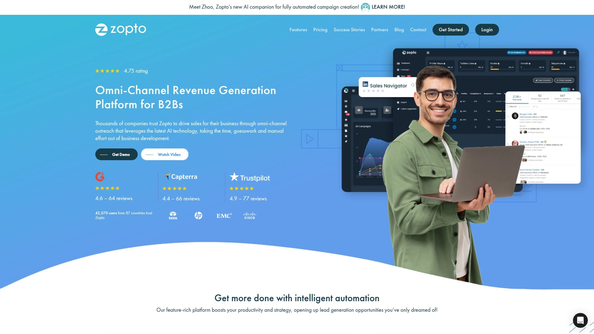

Zopto is a premium LinkedIn automation tool favored by agencies and enterprise teams. Cloud-based infrastructure runs campaigns 24/7 from Zopto's servers using residential proxies, minimizing detection risk. Advanced targeting filters combine LinkedIn search criteria with Zopto's additional parameters for hyper-specific audience selection. A/B testing splits campaigns to test different messages, timing, and sequences, identifying highest-converting approaches. Team collaboration features assign accounts to members, share campaign templates, and track individual performance.

Zopto's reporting is agency-grade—white-label dashboards, client-facing analytics, export to PDF/CSV, and custom KPI tracking. The platform supports unlimited campaigns per account and handles multiple LinkedIn profiles under one subscription. Zopto also offers done-for-you services where their team manages campaigns on your behalf, appealing to businesses wanting results without hands-on management. The tool caters to experienced users comfortable with premium pricing in exchange for advanced features and reliability.

Pricing: Growth at $215/month (1 LinkedIn account, cloud-based, A/B testing, advanced targeting), Agency plans starting $595/month (multiple accounts, team management, white-label). Fourteen-day free trial available.

---

## FAQ

**How do I get started with LinkedIn prospecting automation without risking my account?**

Start with cloud-based tools (Waalaxy, Dripify, Expandi) that mimic human behavior and use dedicated IPs. Set conservative daily limits (20 connection requests, 50 messages), enable random delays, and warm up new accounts gradually. Avoid browser extensions running locally—they're easier for LinkedIn to detect. Always personalize messages; generic copy triggers spam filters.

**Can these tools find email addresses for LinkedIn prospects automatically?**

Yes, tools like Waalaxy, Apollo, Lemlist, Kaspr, Hunter, and Lusha include email finders that extract verified addresses from LinkedIn profiles. Most check multiple databases and validate deliverability before providing results. Accuracy varies (60-85% hit rates typical), so expect some gaps—but it's vastly faster than manual searches.

**Which tool works best for agencies managing multiple client LinkedIn accounts?**

HeyReach and Expandi are built specifically for agencies, offering client workspaces, sender rotation across multiple accounts, unified inboxes, white-label options, and master dashboards for overseeing all activity. Zopto also caters to agencies with premium reporting and done-for-you services. Standard tools like Dripify and Waalaxy work for smaller agency setups but lack advanced multi-account features.

***

## Conclusion

LinkedIn prospecting doesn't have to feel like digging trenches with a spoon. The right automation handles repetitive tasks, enriches data automatically, and scales outreach without sacrificing personalization or account safety. For teams wanting the simplest entry point—cloud-based execution, multichannel sequences, built-in email finding, and no technical setup—[Waalaxy](https://www.waalaxy.com) delivers the best balance of power and usability. Install the extension, pick a template, import leads, launch, and watch conversations start flowing while you focus on closing deals instead of clicking buttons.
